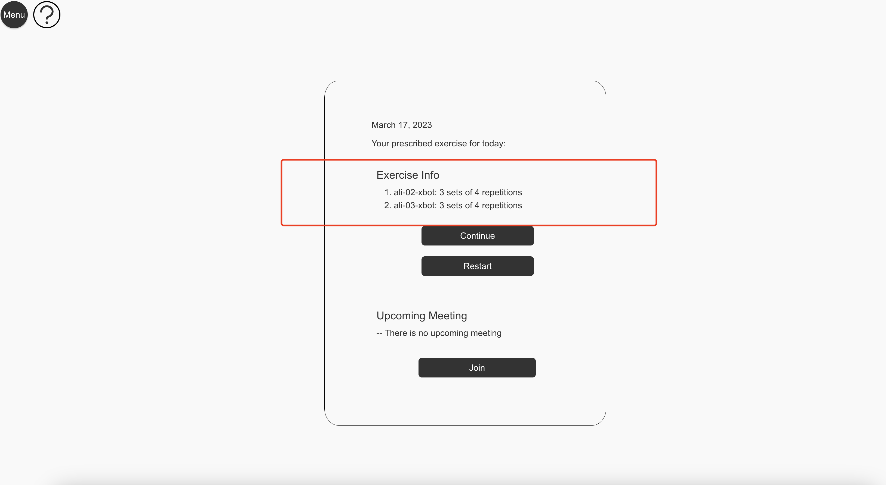
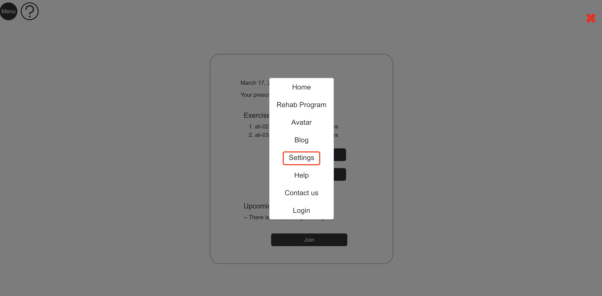

This is a [Next.js](https://nextjs.org/) project bootstrapped with [`create-next-app`](https://github.com/vercel/next.js/tree/canary/packages/create-next-app).

## Getting Started

First, run the development server:

```bash
npm run dev
# or
yarn dev
# or
pnpm dev
```

Open [http://localhost:3000](http://localhost:3000) with your browser to see the result.

You can start editing the page by modifying `pages/index.js`. The page auto-updates as you edit the file.

[API routes](https://nextjs.org/docs/api-routes/introduction) can be accessed on [http://localhost:3000/api/hello](http://localhost:3000/api/hello). This endpoint can be edited in `pages/api/hello.js`.

The `pages/api` directory is mapped to `/api/*`. Files in this directory are treated as [API routes](https://nextjs.org/docs/api-routes/introduction) instead of React pages.

This project uses [`next/font`](https://nextjs.org/docs/basic-features/font-optimization) to automatically optimize and load Inter, a custom Google Font.

## Learn More

To learn more about Next.js, take a look at the following resources:

- [Next.js Documentation](https://nextjs.org/docs) - learn about Next.js features and API.
- [Learn Next.js](https://nextjs.org/learn) - an interactive Next.js tutorial.

You can check out [the Next.js GitHub repository](https://github.com/vercel/next.js/) - your feedback and contributions are welcome!

## Deploy on Vercel

The easiest way to deploy your Next.js app is to use the [Vercel Platform](https://vercel.com/new?utm_medium=default-template&filter=next.js&utm_source=create-next-app&utm_campaign=create-next-app-readme) from the creators of Next.js.

Check out our [Next.js deployment documentation](https://nextjs.org/docs/deployment) for more details.

# Virtural Rehabilitation/TEAM 3
​
> _Note:_ This document is intended to be relatively short. Be concise and precise. Assume the reader has no prior knowledge of your application and is non-technical. 
​
## Description 
- Context:

This is  a responsive website for stroke and cardiovascular patients to do rehabilitation exercises remotely. The application can arrange weekly and daily exercise programs for users, and users can turn on the camera and synchronize training with avatar exercise videos.
- Value behind the application:

This website is going to overcome the location barriers for patients that live far from the rehabilitation stations, as well as to overcome the mobility barriers for patients that contain mobility issues with their body after strokes.
​
## Key Features
 * Patients are able to do daily rehabilitation exercises viturally. 
    * Patients can login their account to see their assinged exercises
    * Patients can choose the avatar gender to do the exercises.
 * Patients are able to record their own exercising videos.
    * Patients can press the record button to do the redording.
 * Patients are able to do online consultation with physicians. 
    * Patients can find their appointments on the calender 
    * Patients can set up their microphone, speaker and camera 
    * Patents can do the meeting with the doctor.
 * Describe the key features in the application that the user can access.
 * Provide a breakdown or detail for each feature.
 * This section will be used to assess the value of the features built
​
## Instructions
   * Login 

   * Home Pop-up 

   * Home/Exercise 

   * Menu

   * Rehab program 

   * Blog 

   * Settings 

   * Contact Us 

   * Meetings

 * Clear instructions for how to use the application from the end-user's perspective
 * How do you access it? For example: Are accounts pre-created or does a user register? Where do you start? etc. 
 * Provide clear steps for using each feature described in the previous section.
 * This section is critical to testing your application and must be done carefully and thoughtfully.

## Instructions(Part 1 of 2 - Register part)
- Page 1: By clicking the URL, you will see the login page.
## 

- Page 2: For new user register, click the register button. After entering the correct information, it will go to page 3 for user email verification, you can enter your personal email address to receive the 5-digits vertification code.
## 

- Page 3: User login email verification, click "login" to access to the main web page.
## 

- User will be able to see the main page after login in.

## Instructions(Part 2 of 2 - App features part)
- Page 1:To test the web features, please use our fake user account. Email: zhou@gmail.com, password: 123. Click login to start testing.
## 

- Page 2: As it is a fake user account, we don't need to enter the 5-digits vertification code, please add "/home" in the URL to access to the home page of the web app.
## 

- Page 3: User will be able to go to the home page of the web app. User should be able to see the exercise informaion they have to finish this week.
## 

- Page 3.1: Before user starts to do daily rehabilitation exercises, user should click on the "setting" button to check if their devices are working.
## 
## 
## 

- Page 4: After checking the devices, now user can click on the "Avatar" button to start doing daily rehabilitation exercises.
## 

- Page 5: User should click on the "Start recording" button to turn on camera and follow the avatar to do daily rehabilitation exercises. If user want to have a rest, user can lick on the "Stop" button to stop the avatar video and they can continue by clicking "Continue"
## 

- Page 6: User can click on "Rehab Program" button from "Menu". Users should be able to see the exercises they have done from the calender.
## 
## 

- Page 7: User can also read the blog of the web app, blogs are about about medicine and health. Users are able to click on the blog to read the detail information.
## 
## 


 ## Development requirements
 * What are the technical requirements for a developer to set up on their machine or server (e.g. OS, libraries, etc.)?
 * Briefly describe instructions for setting up and running the application. You should address this part like how one would expect a README doc of real-world deployed application would be.
 * You can see this [example](https://github.com/alichtman/shallow-backup#readme) to get started.
 
#### Method : Install From Source

- Boostrap is the style framework
- React js and Next js will be used to develop the front end
- Node js on Azure is the backend
- PostgreSQL will be the database on Azure

```bash
$ git clone https://github.com/csc301-2023-winter/3-university-health-network-T.git
$ cd Deliverable-2/app/server/
$ npm install
$ npm run devStart
$ cd ..
$ cd Deliverable-2/app/frontend/uhn_project/
$ npm install
$ npm run
```
 
 ## Deployment and Github Workflow
​
Describe your Git/GitHub workflow. Essentially, we want to understand how your team members share codebase, avoid conflicts and deploys the application.
​

We choose to use  Model-View-Presenter (MVP) to create this virtual rehabilitation website project, we follow the following steps:

* Model: Identify the data and business logic that the website needs to support the virtual rehabilitation program. We need to store user profiles, exercise programs, and progress reports. We create a data model that represents these entities and provides methods for accessing and updating them.

* View: Identify the different views that the website needs to display to users, such as a login page, exercise dashboard, and progress tracking page. Each view should be responsible for rendering data to the user and capturing user input. We create separate classes for each view and define interfaces for them.

* Presenter: The presenter acts as a mediator between the view and model. It processes user input and retrieves data from the model to update the view. We create separate classes for each presenter and define interfaces for them. For instance, we can create a LoginPresenter, ExercisePresenter, and ProgressPresenter.

* Connect the components: Connect the views and presenters using the MVP pattern. Each view should have a reference to its corresponding presenter, and each presenter should have a reference to its corresponding view and model.
Implement the features: Implement the features of the virtual rehabilitation program using the MVP pattern. For instance, we use the LoginPresenter to authenticate users, the ExercisePresenter to display and manage exercise programs, and the ProgressPresenter to track and display user progress.

By using the MVP pattern in our virtual rehabilitation website project, we achieve a clean separation of concerns and improve the maintainability, testability, and scalability of our codebase.

#### Database & Azure (members:Mingyang Li)

#### Backend (members:)

#### Frontend (members:)

 * Be concise, yet precise. For example, "we use pull-requests" is not a precise statement since it leaves too many open questions - Pull-requests from where to where? Who reviews the pull-requests? Who is responsible for merging them? etc.
 * If applicable, specify any naming conventions or standards you decide to adopt.
 * Describe your overall deployment process from writing code to viewing a live application
 * What deployment tool(s) are you using? And how?
 * Don't forget to **briefly justify why** you chose this workflow or particular aspects of it!
​
 ## Licenses 
​
 Keep this section as brief as possible. You may read this [Github article](https://help.github.com/en/github/creating-cloning-and-archiving-repositories/licensing-a-repository) for a start.
​
 * What type of license will you apply to your codebase? And why?
 * What affect does it have on the development and use of your codebase?
